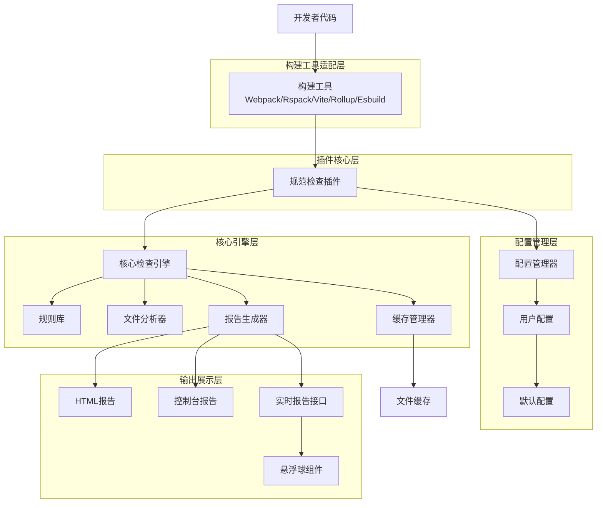
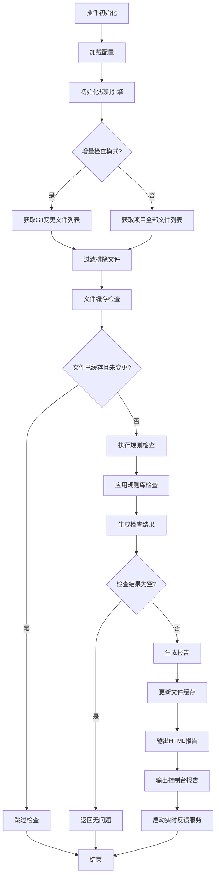
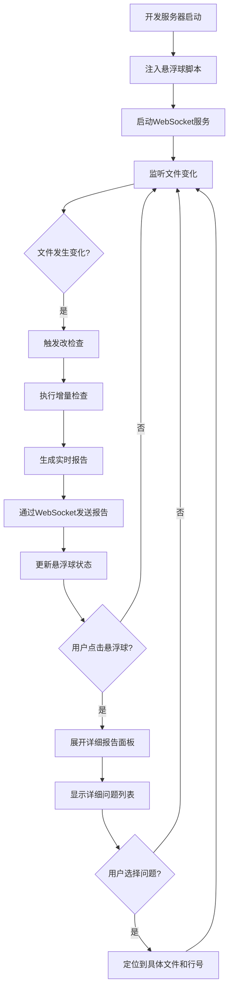

# spec-plugin 需求文档

## 1. 概述

### 1.1 目的
本文档旨在定义 spec-plugin 插件的需求，该插件用于在 Webpack 构建过程中进行代码规范检查，确保代码质量和一致性。插件提供 57 项全面检查，涵盖 Vue2、JavaScript、文件命名、变量命名、导入规范、注释规范、事件规范、空指针防护、边界处理、最佳实践、消息提示一致性、接口安全、表单验证、依赖检查、性能和安全等多个方面。插件还提供友好的可视化报告展示和实时反馈机制，通过页面悬浮球展示实时报告，确保不影响开发效率。插件提供可配置的质量门禁，支持动态修改阈值，以适应不同项目的需求，并通过与coverage-plugin协同工作，提供更全面的质量保障。

### 1.2 范围
本插件最初集成到 Webpack 构建流程中，提供多种代码规范检查规则，包括但不限于：
- Vue2 开发规范检查（13 项专项检查）
- JavaScript 规则检查（8 项语法检查）
- 文件命名规范检查（5 项检查）
- 变量命名检查（6 项检查）
- 导入规范检查（6 项检查）
- 注释规范检查（3 项检查）
- 事件规范检查（9 项专项检查）
- 空指针防护检查（9 项安全检查）
- 边界处理规范检查（11 项边界检查）
- 最佳实践检查（10 项检查）
- 消息提示一致性检查（7 项检查）
- 接口安全检查（8 项检查）
- 表单验证检查（9 项检查）
- 依赖检查（6 项检查）
- 性能检查（图片/JS/CSS 文件大小预算）
- 安全检查（XSS 风险、eval 使用、敏感信息泄露）
- 内存泄漏检查（定时器、事件监听器、全局变量污染）

<!-- 未来将扩展支持多种现代构建工具，包括 Rspack、Vite、Rollup 和 Esbuild，以提升插件的兼容性和灵活性。 -->

插件还提供友好的可视化报告展示和实时反馈机制，通过页面悬浮球展示实时报告，确保不影响开发效率。插件提供可配置的质量门禁，支持动态修改阈值，以适应不同项目的需求，并通过与coverage-plugin协同工作，提供更全面的质量保障。

### 1.3 多构建工具支持规划
为提升插件的兼容性和灵活性，未来将扩展支持多种现代构建工具，包括 Rspack、Vite、Rollup 和 Esbuild。这将使插件能够在更广泛的项目环境中使用，满足不同团队的技术栈需求。

### 1.4 可视化与实时反馈规划
插件将提供丰富的可视化架构图与流程图，并实现友好的规范检查报告展示。对于非阻断性检查，采用页面悬浮球形式展示实时报告，确保不影响开发者编码效率。

插件提供可配置的质量门禁，支持动态修改阈值，以适应不同项目的需求。通过与coverage-plugin协同工作，提供更全面的质量保障。

## 2. 功能需求

### 2.0 架构设计

#### 2.0.1 整体架构图

#### 2.0.2 检查流程图

#### 2.0.3 实时反馈流程图

### 2.1 核心功能

#### 2.1.1 规则引擎
- 支持多种类型的检查规则（57 项全面检查）
- 支持自定义规则扩展
- 支持规则启用/禁用配置
- 支持规则级别配置（警告/错误）
- 支持边界处理规则自定义配置
- 支持规则优先级配置
- 支持规则分组管理
- 支持规则依赖关系配置
- 支持规则执行顺序配置
- 支持规则条件配置
- 支持规则例外配置

规则引擎应具备以下特性：
- 高性能的规则匹配和执行能力
- 支持规则的热插拔和动态加载
- 提供规则执行的详细日志记录
- 支持规则的版本管理和兼容性检查
- 提供规则调试和测试工具
- 支持规则的性能监控和优化
- 支持规则的并行执行
- 提供规则冲突检测和解决机制

#### 2.1.2 文件检查
- 文件命名规范检查（Vue 组件、JS 文件、测试文件等）
- 文件大小限制检查（图片、JS、CSS 文件大小预算）
- 文件格式检查
- 文件内容规范检查
- 文件依赖分析（与coverage-plugin集成）
- 文件权限检查
- 文件编码检查
- 文件重复检查
- 文件版权声明检查

文件检查应具备以下特性：
- 支持自定义文件命名规则
- 提供文件大小违规的详细信息
- 支持多种文件格式的检查
- 提供文件内容的智能分析
- 支持文件依赖关系的可视化展示
- 提供文件权限的安全检查
- 支持文件编码的自动检测和转换建议
- 提供文件重复检测和合并建议
- 支持文件版权声明的自动生成和验证
- 提供文件变更历史的追踪和分析

#### 2.1.3 代码风格检查
- JavaScript/TypeScript 代码风格检查（禁用 var、严格相等、模板字符串等）
- CSS/SCSS 代码风格检查
- Vue 组件代码风格检查（组件命名、Props、生命周期等）
- 注释规范检查（JSDoc、TODO/FIXME、大段注释代码）
- 函数命名检查
- 类命名检查
- 接口命名检查
- 变量命名检查
- 常量命名检查
- 枚举命名检查
- 文件命名检查
- 目录命名检查

代码风格检查应具备以下特性：
- 支持主流代码风格规范（如Airbnb、Google等）
- 提供代码风格的自定义配置能力
- 支持代码风格的自动修复功能
- 提供代码风格违规的详细说明和修复建议
- 支持代码风格的团队协作配置
- 提供代码风格的历史对比和趋势分析
- 支持代码风格的实时检查和反馈
- 提供代码风格的批量修复工具
- 支持代码风格的继承和覆盖机制
- 提供代码风格的可视化配置界面

#### 2.1.4 安全检查
- 潜在安全漏洞检查（XSS 风险、eval 使用）
- 敏感信息泄露检查
- 第三方库安全检查
- 权限相关代码检查
- 内存泄漏检查（定时器、事件监听器、全局变量污染）
- 不安全的随机数检查
- 不安全的HTTP请求检查
- 不安全的DOM操作检查
- 不安全的正则表达式检查
- 不安全的eval使用检查
- 不安全的Function构造函数使用检查

安全检查应具备以下特性：
- 支持常见安全漏洞的自动检测
- 提供安全风险的详细分析和修复建议
- 支持第三方库的安全版本检查
- 提供权限配置的安全审计功能
- 支持敏感信息的自动识别和保护
- 提供安全检查的定期扫描和监控
- 支持安全规则的自定义和扩展
- 提供安全漏洞的修复模板和示例
- 支持安全检查的实时预警和通知
- 提供安全审计报告和合规性检查

#### 2.1.5 性能检查
- 代码复杂度检查
- 重复代码检查
- 大文件检查（图片/JS/CSS 文件大小预算）
- 依赖合理性检查
- 图片/JS/CSS 文件大小预算检查
- 打包体积检查
- 代码分割检查
- 懒加载检查
- Tree-shaking检查
- gzip压缩检查

性能检查应具备以下特性：
- 提供代码复杂度的详细分析和优化建议
- 支持重复代码的自动识别和合并建议
- 提供文件大小违规的详细信息和优化方案
- 支持依赖关系的可视化展示和优化建议
- 提供打包体积的分析报告和优化指导
- 支持代码分割的最佳实践检查
- 提供性能瓶颈的实时监控和预警
- 支持性能优化建议的自动生成
- 提供性能基准测试和对比分析
- 支持性能优化的可视化展示和跟踪

#### 2.1.6 事件规范检查
- Vue2 事件规范检查（9 项专项检查）
- JavaScript 事件规范检查
- Vue 事件命名检查（驼峰命名应报错）
- Vue 事件 kebab-case 命名检查（正确）
- $emit 缺少参数检查
- addEventListener 未清理检查
- 使用 preventDefault 而不是修饰符检查
- 模糊事件名检查
- JS 事件监听器未清理检查
- 事件处理函数命名不规范检查
- 事件参数使用缩写检查
- 事件修饰符使用检查

事件规范检查应具备以下特性：
- 提供事件命名规范的详细说明和示例
- 支持事件监听器的自动清理检查
- 提供事件修饰符的正确使用指导
- 支持事件参数命名的最佳实践检查
- 提供事件处理函数的命名规范建议
- 支持事件绑定和解绑的配对检查
- 提供事件性能优化建议
- 支持事件处理函数的复杂度检查
- 提供事件相关代码的可视化展示
- 支持事件规范的自定义配置

#### 2.1.7 空指针防护检查
- 不安全的属性访问检查
- 不安全的数组访问检查
- 不安全的函数调用检查
- API 响应不安全访问检查
- DOM 元素不安全访问检查
- 不安全的解构赋值检查
- Vue Props 不安全访问检查
- === undefined 建议使用 == null 检查
- 可选链使用检查
- 空值合并操作符使用检查

空指针防护检查应具备以下特性：
- 提供空值检查的最佳实践指导
- 支持可选链和空值合并操作符的使用检查
- 提供API响应数据的安全访问建议
- 支持DOM元素访问的安全检查
- 提供解构赋值的安全使用指导
- 支持Vue Props的类型安全检查

### 2.2 报告功能

#### 2.2.1 检查报告
- 生成详细的检查报告（HTML 报告和控制台报告）
- 支持多种报告格式（JSON、HTML等）
- 支持报告自定义模板
- 支持报告输出路径配置
- HTML 报告包含详细修复方案、代码对比、优先级标签
- HTML 报告支持统计图表（规则分布可视化）
- HTML 报告支持整体总结、问题分类、优先级建议

检查报告应具备以下特性：
- 提供报告的实时生成和更新功能
- 支持报告的多维度分析和可视化展示
- 提供报告的导出和分享功能
- 支持报告的版本管理和历史对比
- 提供报告的自定义配置和模板管理
- 支持报告的自动化生成和定时发送

#### 2.2.2 统计信息
- 检查文件数量统计
- 发现问题数量统计
- 问题分类统计
- 修复建议提供
- 问题优先级标签（P0/P1/P2 明确标识）
- 规则分布统计图表

统计信息应具备以下特性：
- 提供实时的统计数据更新功能
- 支持统计数据的多维度分析和可视化展示
- 提供统计数据的历史趋势分析
- 支持统计数据的导出和分享功能
- 提供统计数据的自定义筛选和排序功能
- 支持统计数据的对比分析和基准比较

#### 2.2.3 可视化报告要求
报告提供友好的可视化展示，包含总体合规统计和精确的问题定位。

- 提供开发者信息（git用户名、当前分支、提交哈希、硬件信息）
- 提供代码质量指标（代码总量、代码复杂度评分、重要代码标识）
- 提供自测覆盖率信息（与coverage-plugin集成）
- 提供质量门禁状态（可配置阈值）
- 提供影响范围分析（依赖关系图、影响传播路径）
- 提供精确到页面/文件/行号的问题定位
- 提供具体不符合项说明及修改建议
- 提供代码对比视图（修改前/修改后）
- 提供修复步骤引导
- 提供仪表板视图（关键指标仪表盘、趋势图表、问题分布热力图）
- 提供回归测试建议
- 提供相关文档链接

报告应具备以下特征：
- 友好的用户界面设计，易于理解和操作
- 支持深浅色主题切换
- 支持响应式布局，适配不同屏幕尺寸
- 提供搜索和筛选功能，便于快速定位问题
- 支持导出报告为PDF或HTML格式
- 提供问题分类标签，便于过滤和管理

#### 2.2.4 实时反馈机制
对于非阻断性规范检查，插件提供页面悬浮球形式的实时反馈机制，确保不影响开发者编码效率。

- 提供页面悬浮球组件，展示实时报告
- 悬浮球实时显示当前检查状态（绿色/黄色/红色）
- 点击悬浮球可展开详细报告面板
- 支持悬浮球拖拽移动位置
- 支持悬浮球最小化/最大化
- 提供实时报告接口，支持动态更新
- 支持快捷键显示/隐藏悬浮球
- 支持自定义悬浮球样式和位置
- 支持悬浮球透明度调节

悬浮球组件应具备以下特性：
- 轻量级设计，不占用过多屏幕空间
- 支持鼠标悬停预览简要信息
- 提供动画效果，增强用户体验
- 支持静音模式，避免干扰开发者
- 提供历史记录查看功能
- 支持问题快速导航至具体代码位置

### 2.3 集成能力

#### 2.3.1 构建工具集成
- 无缝集成到 Webpack 构建流程
<!-- - 未来将扩展支持 Rspack、Vite、Rollup 和 Esbuild 等现代构建工具 -->
- 支持开发环境和生产环境配置
- 支持构建过程中的实时检查
- 支持构建结果的门禁控制（根据 severity 配置决定是否中断构建）

构建工具集成应具备以下特性：
- 提供统一的插件接口和配置方式
- 支持不同构建工具的特性适配
- 提供构建过程的详细日志记录
- 支持构建性能的监控和优化
- 提供构建错误的详细分析和修复建议
- 支持构建配置的继承和覆盖机制

#### 2.3.2 CI/CD 集成
- 支持在 CI/CD 流程中运行
- 支持检查结果门禁控制
- 支持检查结果报告生成
- 支持与主流 CI/CD 工具集成
- 支持 Git Hooks 集成（pre-commit 自动检查）

CI/CD 集成应具备以下特性：
- 提供标准化的集成接口和配置方式
- 支持不同 CI/CD 平台的特性适配
- 提供集成过程的详细日志记录
- 支持集成性能的监控和优化
- 提供集成错误的详细分析和修复建议
- 支持集成配置的继承和覆盖机制

#### 2.3.3 开发工具集成
- 支持增量检查模式（只检查 Git 变更文件）
- 支持全量检查模式
- 支持文件缓存机制（MD5 哈希缓存，避免重复检查）
- 支持与coverage-plugin协同工作
- 提供开发服务器集成
- 支持热重载环境下的实时检查
- 支持编辑器插件集成（VSCode、WebStorm等）
- 支持CLI命令行工具

开发工具集成应具备以下特性：
- 提供高效的增量检查算法和缓存机制
- 支持多种开发工具的特性适配
- 提供开发过程的详细日志记录
- 支持开发性能的监控和优化
- 提供开发错误的实时反馈和修复建议
- 支持开发配置的继承和覆盖机制

## 3. 非功能需求

### 3.1 性能要求
- 检查过程不影响构建性能
- 支持增量检查（只检查 Git 变更文件）
- 支持并行处理
- 内存占用合理
- 支持文件缓存机制（MD5 哈希缓存，避免重复检查）
- 检查速度提升显著（小型项目提升 2-3 倍，大型项目提升 5-10 倍）
- 支持异步非阻塞检查
- 支持后台检查模式
- 支持可配置的严格程度（normal/strict）
- 支持检查过程的进度显示
- 支持检查结果的实时更新

性能优化应考虑以下方面：
- 支持多线程并发检查，充分利用多核CPU资源
- 提供内存使用监控和优化建议
- 支持检查任务的优先级调度
- 提供性能分析工具，帮助识别性能瓶颈
- 支持检查过程的中断和恢复机制
- 提供检查时间统计和性能报告

### 3.2 兼容性要求
- 支持 Webpack 4.x 和 5.x 版本
<!-- - 未来将扩展支持 Rspack、Vite、Rollup 和 Esbuild 等现代构建工具 -->
- 支持主流前端框架（Vue2 等）
- 支持不同操作系统
- 支持不同 Node.js 版本
- 支持 TypeScript 类型提示

兼容性保障应考虑以下方面：
- 提供详细的兼容性矩阵，明确支持的版本范围
- 支持向后兼容性，确保新版本不会破坏现有配置
- 提供迁移指南，帮助用户从旧版本升级
- 支持渐进式增强，在不支持的环境中优雅降级
- 提供兼容性测试套件，确保跨平台稳定性
- 支持国际化和本地化，适配不同地区的开发环境

### 3.3 安全性要求

- 不会泄露项目敏感信息
- 所有生成文件位于 .spec-cache 目录中，已自动添加到 .gitignore，不影响版本控制
- 支持敏感信息过滤配置

## 4. 验收标准

### 4.1 功能验收标准
- 所有检查规则功能正确（57 项全面检查）
- 报告生成功能正常（支持 HTML 报告和控制台报告）
- 集成能力符合要求（Webpack 集成、Git Hooks 集成）
- 提供完整的单元测试
- 支持规则启用/禁用配置
- 支持性能预算配置
- 支持边界处理规则自定义配置
- 支持规则级别配置（警告/错误）
- 支持质量门禁配置
- 支持可视化报告展示
- 支持实时反馈机制
- 支持与coverage-plugin协同工作
- 支持编辑器插件集成

功能验收应考虑以下方面：
- 提供自动化测试套件，确保功能稳定性
- 支持持续集成，自动验证功能正确性
- 提供测试覆盖率报告，确保测试完整性
- 支持回归测试，防止功能退化
- 提供性能基准测试，确保性能达标
- 支持跨平台测试，确保兼容性

### 4.2 性能验收标准
- 检查过程时间合理（增量检查模式下效率高）
- 内存占用符合预期
- 支持大型项目检查
- 增量检查效果明显
- 文件缓存机制有效（未变更文件跳过检查，提高检查效率 ~85%）
- 支持增量检查和全量检查两种模式
- 实时反馈机制不影响开发效率
- 异步非阻塞检查不阻塞构建主线程
- 检查过程支持进度显示
- 检查结果支持实时更新

性能验收应考虑以下方面：
- 提供性能基准测试报告，明确性能指标
- 支持性能监控，实时跟踪性能变化
- 提供性能优化建议，帮助用户提升性能
- 支持性能调优配置，满足不同场景需求
- 提供性能对比分析，展示优化效果
- 支持性能瓶颈诊断，快速定位问题

### 4.3 兼容性验收标准
- 在目标 Webpack 版本中正常运行（支持 Webpack 4.x 和 5.x）
- 与主流前端框架兼容（Vue2 等）
- 无兼容性问题
- 支持不同操作系统和 Node.js 版本
- 支持 TypeScript 类型提示
<!-- - 未来将支持 Rspack、Vite、Rollup 和 Esbuild 等现代构建工具 -->
- 可视化报告在主流浏览器中正常显示
- 实时反馈机制在不同开发环境中正常工作
- 编辑器插件在主流编辑器中正常工作

兼容性验收应考虑以下方面：
- 提供兼容性测试报告，明确支持的环境范围
- 支持向后兼容性测试，确保升级不影响现有功能
- 提供兼容性问题修复指南，帮助用户解决问题
- 支持多版本并行测试，确保各版本稳定性
- 提供环境配置建议，优化兼容性表现
- 支持兼容性问题反馈机制，及时收集用户反馈

## 5. 配置选项

### 5.1 基础配置
基础配置用于控制插件的基本行为和运行环境。

- mode: 检查模式（'incremental' 增量检查 | 'full' 全量检查）
- severity: 严格程度（'normal' 只有错误中断构建 | 'strict' 所有问题中断构建）
- rules: 规则配置
- performanceBudget: 性能预算配置（图片、JS、CSS 文件大小限制）
- htmlReport: 是否生成 HTML 报告
- reportPath: HTML 报告输出路径
- exclude: 排除文件配置（默认包含 node_modules、dist 等目录）
- rootDir: 项目根目录
- qualityGate: 质量门禁配置
- cache: 是否启用缓存（默认 true）
- cacheDir: 缓存目录（默认 '.spec-cache'）
- threads: 并行线程数（默认 CPU 核心数）
- timeout: 检查超时时间（毫秒，默认 30000）

基础配置应支持以下特性：
- 支持配置文件继承，减少重复配置
- 提供配置校验机制，确保配置有效性
- 支持环境变量覆盖，灵活调整配置
- 提供配置模板，快速初始化项目
- 支持配置热更新，无需重启即可生效
- 提供配置文档和示例，降低使用门槛

### 5.2 规则配置
规则配置用于启用或禁用特定的检查规则，所有规则默认为 true（启用）。

- naming: 文件命名规范检查
- comments: 注释规范检查
- performance: 性能规范检查
- imports: 导入规范检查
- assets: 资源规范检查
- variableNaming: 变量命名检查
- memoryLeak: 内存泄漏检查
- security: 安全检查
- javascript: JavaScript 语法规范检查
- vue: Vue 开发规范检查
- css: CSS 开发规范检查
- event: 事件规范检查（Vue2 + JavaScript）
- nullSafety: 空指针防护检查
- boundary: 边界处理规范检查
- bestPractice: 最佳实践检查
- messageConsistency: 消息提示一致性检查
- apiSafety: 接口安全检查
- formValidation: 表单验证检查
- dependencyCheck: 依赖检查

此外，还支持更细粒度的规则级别配置，可以为每个规则设置警告（warning）或错误（error）级别。详细的规则分类和配置项请参考 [规则分类详表](#_2-1-1-1-规则分类详表)。

规则配置应支持以下特性：
- 支持规则组的批量启用/禁用
- 提供规则依赖关系管理
- 支持规则优先级设置
- 支持规则条件配置（如仅在特定文件类型中启用）
- 提供规则例外配置（如排除特定文件或目录）
- 支持规则配置的继承和覆盖机制
- 支持规则的动态加载和卸载
- 提供规则配置的验证和错误提示

### 5.3 边界处理配置
边界处理配置允许开发者自定义边界检查规则，以适应不同的项目需求。

- checkDivisionZero: 是否检查除零错误
- checkArrayBounds: 是否检查数组越界
- checkObjectAccess: 是否检查对象属性访问
- checkJsonParse: 是否检查JSON.parse
- checkLoopBounds: 是否检查循环边界
- checkRecursionDepth: 是否检查递归深度
- checkStringIndex: 是否检查字符串索引越界
- checkMathOperations: 是否检查数学运算溢出
- checkTypeConversion: 是否检查类型转换边界
- checkFunctionParameters: 是否检查函数参数边界
- checkReturnValue: 是否检查返回值边界

边界处理配置应支持以下特性：
- 支持自定义边界检查规则
- 提供边界检查的详细日志记录
- 支持边界检查的例外配置
- 提供边界检查的最佳实践建议
- 支持边界检查的性能优化配置
- 提供边界检查的调试工具

### 5.4 性能预算配置
性能预算配置用于控制项目的性能指标，确保代码质量和用户体验。

- maxImageSize: 单个图片最大大小（KB）
- maxJsSize: 单个JS文件最大大小（KB）
- maxCssSize: 单个CSS文件最大大小（KB）
- maxFontSize: 单个字体文件最大大小（KB）
- maxBundleSize: 最大打包体积（KB）
- maxLoadTime: 最大加载时间（毫秒）
- maxFirstPaintTime: 最大首次绘制时间（毫秒）
- maxFirstContentfulPaintTime: 最大首次内容绘制时间（毫秒）

性能预算配置应支持以下特性：
- 支持根据不同环境设置不同的性能预算
- 提供性能预算的实时监控和预警功能
- 支持性能预算的动态调整
- 提供性能预算违反时的详细报告和建议修复方案
- 支持性能预算配置的继承和覆盖机制
- 提供性能预算的历史记录和趋势分析

### 5.5 报告配置
报告配置用于控制生成的检查报告的格式和输出位置。

- htmlReport: 是否生成 HTML 报告（默认 true）
- reportPath: HTML 报告输出路径（默认 '.spec-cache/spec-report.html'）
- jsonReport: 是否生成 JSON 报告（默认 false）
- jsonReportPath: JSON 报告输出路径（默认 '.spec-cache/spec-report.json'）
- consoleReport: 是否在控制台输出报告（默认 true）
- reportTemplate: 自定义报告模板路径
- reportTitle: 报告标题
- reportLogo: 报告 Logo 路径

报告配置应支持以下特性：
- 支持自定义报告模板
- 提供报告生成的详细日志记录
- 支持报告的多格式输出（HTML、JSON、XML等）
- 提供报告的在线浏览和离线下载功能
- 支持报告的定期清理和存储管理
- 提供报告的版本管理和历史记录查询

### 5.6 质量门禁配置
插件提供可配置的质量门禁，支持动态修改阈值，以适应不同项目的需求。

- maxErrors: 最大允许错误数（默认0）
- maxWarnings: 最大允许警告数（默认10）
- minCodeQualityScore: 最低代码质量评分（默认80）
- minLineCoverage: 最低行覆盖率（与coverage-plugin集成，默认80）
- minBranchCoverage: 最低分支覆盖率（与coverage-plugin集成，默认70）
- maxBundleSize: 最大打包体积(KB，默认500）
- maxImageSize: 最大图片尺寸(KB，默认200）
- securityIssuesAllowed: 允许的安全问题数（默认0）
- maxComplexity: 最大代码复杂度（默认10）
- minDocumentationCoverage: 最低文档覆盖率（默认80）
- maxResponseTime: 最大响应时间（毫秒，默认1000）
- minAccessibilityScore: 最低无障碍评分（默认90）

质量门禁配置应支持以下特性：
- 支持根据不同环境（开发、测试、生产）设置不同的门禁阈值
- 提供门禁状态实时监控和预警功能
- 支持门禁规则的动态调整，无需重启构建过程
- 提供门禁违反时的详细报告和建议修复方案
- 支持门禁配置的继承和覆盖机制
- 提供门禁历史记录和趋势分析

## 6. 与其他模块的协同

spec-plugin 作为一个独立的 Webpack 插件，可以与其他 Webpack 插件协同工作。

### 6.1 Git Hooks 集成
- 支持 pre-commit hook：提交前自动检查
- 支持 commit-msg hook：检查 commit message 格式
- 提供一键安装脚本
- 自动更新 package.json

Git Hooks 集成应具备以下特性：
- 提供简单的安装和配置方式
- 支持自定义 hook 脚本和触发条件
- 提供 hook 执行的详细日志记录
- 支持 hook 性能的监控和优化
- 提供 hook 错误的详细分析和修复建议
- 支持 hook 配置的继承和覆盖机制

### 6.2 文件缓存机制
- 自动缓存文件检查结果
- 文件未修改时跳过检查
- 使用 MD5 哈希判断文件变化
- 大幅提升检查速度（小型项目提升 2-3 倍，大型项目提升 5-10 倍）

文件缓存机制应具备以下特性：
- 提供高效的缓存算法和存储机制
- 支持缓存的自动清理和更新
- 提供缓存命中的详细统计信息
- 支持缓存性能的监控和优化
- 提供缓存错误的详细分析和修复建议
- 支持缓存配置的继承和覆盖机制

### 6.3 实时反馈机制
- 提供页面悬浮球组件，展示实时报告
- 悬浮球实时显示当前检查状态（绿色/黄色/红色）
- 点击悬浮球可展开详细报告面板
- 支持悬浮球拖拽移动位置
- 支持悬浮球最小化/最大化
- 提供实时报告接口，支持动态更新
- 支持快捷键显示/隐藏悬浮球

实时反馈机制应具备以下特性：
- 提供高效的实时通信和更新机制
- 支持反馈内容的自定义和配置
- 提供反馈性能的监控和优化
- 支持反馈错误的详细分析和修复建议
- 提供反馈配置的继承和覆盖机制
- 支持反馈历史记录的查询和管理

## 7. 文档要求

### 7.1 README 文档
- 提供项目概述和核心功能介绍（57 项全面检查）
- 包含安装和使用指南
- 提供详细的 API 文档和使用示例
- 包含贡献指南和许可证信息
- 包含真实项目验证报告和优化价值说明
- 提供 HTML 报告示例和修复示例
- 包含特色功能说明（不污染项目目录、智能缓存机制、优先级系统）
- 提供架构图和流程图
- 提供可视化报告展示说明
- 提供实时反馈机制说明

README 文档应具备以下特性：
- 结构清晰，便于快速查找信息
- 语言简洁，易于理解
- 提供多种语言版本，满足国际化需求
- 包含常见问题解答，减少用户疑问
- 提供社区支持信息，方便用户交流
- 定期更新，保持内容时效性

### 7.2 规则文档
- 为每个检查规则提供详细的说明文档
- 包含规则配置选项和使用示例
- 提供规则定制指南
- 支持 TypeScript 类型提示
- 提供 Vue2 规范文档（1160 行详细指南）
- 提供 JavaScript 规范文档（1200 行详细指南）
- 提供事件规范文档（9 项事件处理规范）
- 提供空指针防护规范文档（9 项防空检查）
- 提供边界处理规范文档（11 项边界检查）
- 提供 HTML 报告文档（报告功能详解）
- 提供性能检查文档
- 提供安全检查文档
- 提供内存泄漏检查文档
- 提供多构建工具适配文档
- 提供可视化报告设计文档
- 提供实时反馈机制设计文档
- 提供质量门禁配置文档
- 提供协同工作集成文档

规则文档应具备以下特性：
- 结构化组织，便于按类别查找
- 提供搜索功能，快速定位规则
- 包含实际案例，加深理解
- 提供最佳实践建议，指导正确使用
- 支持在线浏览和离线下载
- 定期更新，反映最新规则变化

### 7.3 使用示例
- 提供完整的 Webpack 配置使用示例
- 包含常见场景的解决方案
- 提供最佳实践指导
- 包含错误处理示例
- 提供开发环境和生产环境的不同配置示例
- 提供规则启用/禁用配置示例
- 提供性能预算配置示例
- 提供多构建工具配置示例
- 提供质量门禁配置示例
- 提供可视化报告配置示例
- 提供实时反馈机制配置示例
- 提供与coverage-plugin协同工作配置示例

使用示例应具备以下特性：
- 覆盖典型应用场景，满足大部分用户需求
- 提供逐步指导，降低学习成本
- 包含实际项目代码，增强实用性
- 提供配置说明，解释关键参数作用
- 支持在线运行，便于快速验证
- 定期更新，保持与最新版本一致

### 7.4 更新日志
- 遵循标准的 CHANGELOG 格式
- 记录每个版本的功能新增、bug修复和破坏性变更
- 提供升级指南和兼容性说明
- 记录真实项目验证结果和性能对比数据
- 包含新功能说明和最佳实践建议
- 记录规则更新和改进
- 记录规则分类调整和配置项变更
- 记录多构建工具支持进展
- 记录可视化报告和实时反馈机制进展

更新日志应具备以下特性：
- 结构清晰，便于追踪版本变化
- 内容详实，提供足够的升级信息
- 语言准确，避免歧义
- 及时更新，与版本发布同步
- 提供回滚指南，应对升级问题
- 包含社区反馈，体现用户需求

## 8. 发布和版本管理

### 构建工具扩展路线图

#### 第一阶段：核心引擎重构
- 抽离 spec-plugin 中的核心检查逻辑
- 建立统一的规则执行框架
- 创建独立的规则库

#### 第二阶段：多构建工具支持
- 开发 Rspack 插件（优先级最高，因与 Webpack 兼容性好）
- 开发 Vite 插件
- 开发 Rollup 插件
- 开发 Esbuild 插件

#### 第三阶段：通用工具化
- 开发独立 CLI 工具
- 支持在任何项目中运行
- 提供编辑器集成方案

#### 第四阶段：可视化与实时反馈机制完善
- 开发可视化报告生成器
- 实现页面悬浮球组件
- 建立实时报告接口
- 完善质量门禁配置功能

路线图应具备以下特性：
- 明确各阶段目标和交付物
- 提供时间节点和里程碑

### 8.1 版本规范
- 遵循语义化版本规范（SemVer）
- 主版本号：不兼容的API修改
- 次版本号：向下兼容的功能性新增
- 修订号：向下兼容的问题修正

版本规范应具备以下特性：
- 明确版本号含义和使用场景
- 提供版本升级指导和兼容性说明
- 支持预发布版本和构建元数据
- 提供版本回滚和降级方案
- 包含版本安全更新和补丁发布
- 支持长期支持版本（LTS）策略

### 8.2 发布流程
- 自动化测试通过后才能发布
- 发布前进行代码审查
- 确保文档和示例代码更新完毕
- 提供详细的更新日志
- 提供升级指南和兼容性说明

发布流程应具备以下特性：
- 自动化构建和测试，确保发布质量
- 性能基准测试，确保性能达标

### 8.3 npm 包管理
- 发布到 npm 公共仓库 (@51jbs/spec-plugin)
- 支持 CDN 引入 (unpkg, jsDelivr)
- 提供 UMD、ES Module、CommonJS 等多种格式
- 包含完整的类型定义文件 (index.d.ts)
- 支持 tree-shaking 优化
- 提供 package.json 元数据（keywords, homepage, repository, bugs等）
- 支持 peerDependencies（webpack: ^5.0.0）

npm 包管理应具备以下特性：
- 规范化包结构，确保一致性
- 优化包大小，减少下载时间
- 提供多种引入方式，满足不同需求
- 支持版本标签，便于管理
- 包含安全扫描，防止恶意代码
- 提供使用统计，了解用户情况

### 8.4 特色功能
- 不污染项目目录：所有生成文件都在 .spec-cache 目录中
- 智能缓存机制：基于 MD5 哈希缓存，未变更文件跳过检查，提高检查效率 ~85%
- 优先级系统：P0（立即修复）、P1（尽快修复）、P2（计划修复）
- Git Hooks 集成：支持 pre-commit 和 commit-msg hooks
- 增量检查模式：只检查 Git 变更文件，提高开发效率
- 57 项全面检查：覆盖 Vue2、JavaScript、文件命名、变量命名、导入规范、注释规范、事件规范、空指针防护、边界处理、最佳实践、消息提示一致性、接口安全、表单验证、依赖检查、性能和安全等多个方面
<!-- - 多构建工具支持：未来将支持 Rspack、Vite、Rollup 和 Esbuild 等现代构建工具 -->
- 可视化报告：提供友好的可视化报告展示
- 实时反馈机制：通过页面悬浮球展示实时报告，不影响开发效率
- 质量门禁：可配置的质量门禁，支持动态修改阈值
- 协同工作：与coverage-plugin协同工作，提供更全面的质量保障
- 编辑器集成：支持VSCode、WebStorm等主流编辑器插件
- 私有化部署：支持私有化部署，保障代码安全

特色功能应具备以下特性：
- 用户友好，降低使用门槛
- 高效实用，提升开发效率
- 灵活可配置，适应不同需求
- 安全可靠，保障代码质量
- 持续创新，保持技术领先
- 社区支持，促进生态发展

## 9. 总结

spec-plugin 作为一个全面的代码规范检查工具，旨在提升前端项目的代码质量和开发效率。通过提供57项全面检查规则、友好的可视化报告展示和实时反馈机制，插件能够帮助开发者及时发现和修复代码问题。

插件的设计充分考虑了性能、兼容性和安全性要求，支持多种构建工具和前端框架，能够适应不同规模和类型的项目需求。通过可配置的质量门禁和灵活的规则配置，插件可以在保证代码质量的同时，避免过度限制开发效率。

未来，插件将继续扩展对更多构建工具的支持，完善可视化和实时反馈功能，提供更全面的质量保障解决方案。通过与coverage-plugin等其他工具的协同工作，插件将成为前端质量保障体系的重要组成部分。
