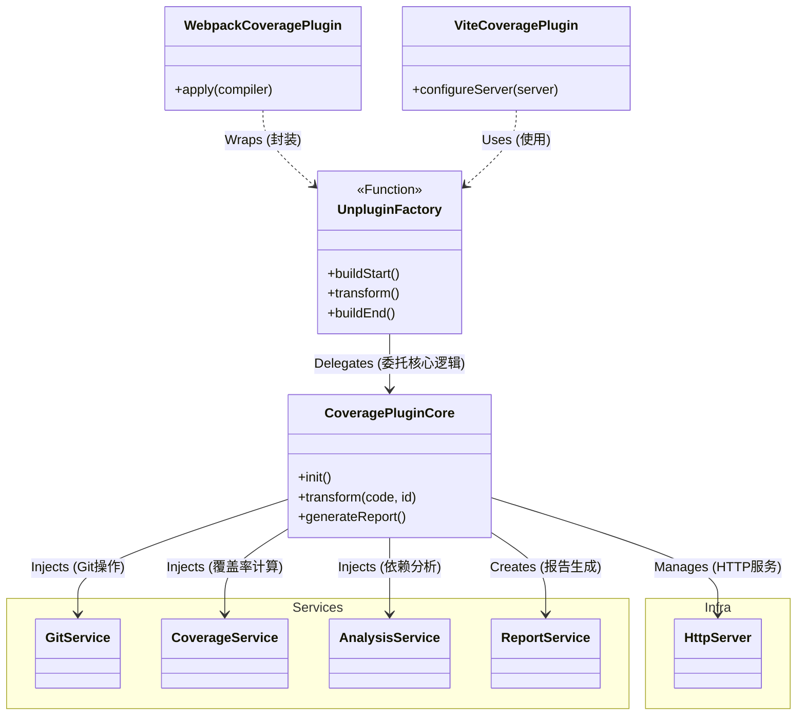
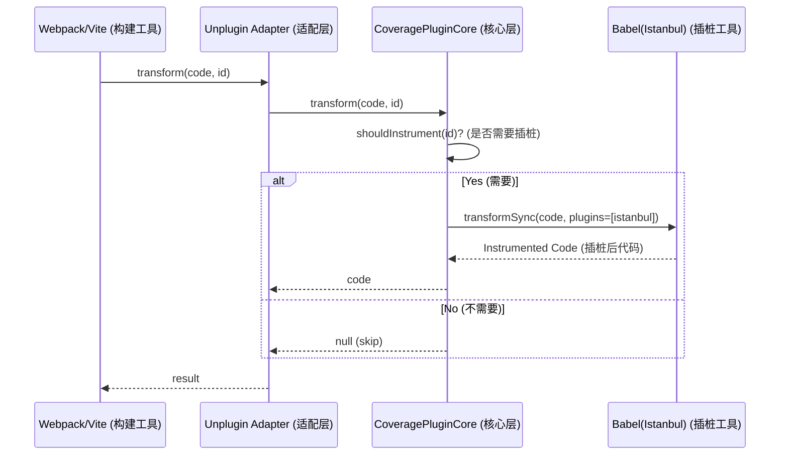
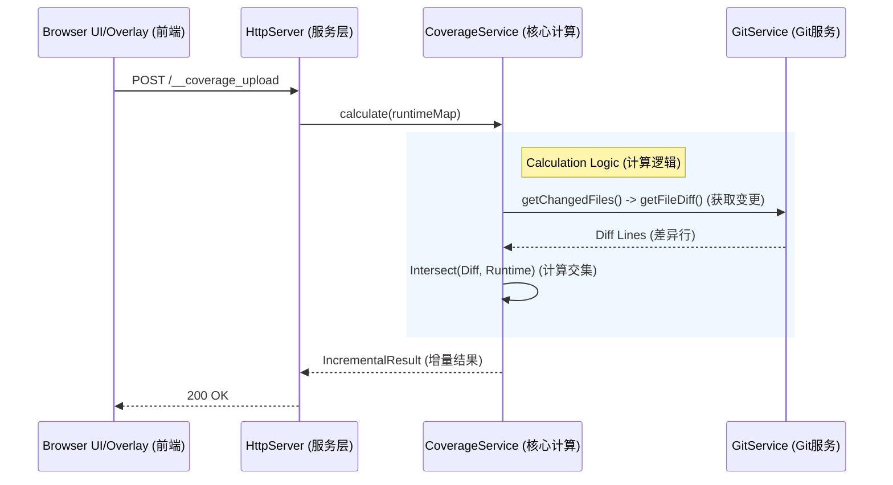

# 技术架构文档 (Technical Documentation)

## 1. 架构概览 (Architecture Overview)

本插件采用 **Universal Plugin Architecture (通用插件架构)** 结合 **Clean Architecture (整洁架构)** 设计。旨在通过一套核心逻辑同时支持 Webpack, Vite, Rollup, Rspack 等多种构建工具。

### 核心分层
- **Core Layer (`src/core`)**: 
    - **Entity (Types/Interfaces)**: 定义核心业务实体和接口。
    - **Use Cases (`PluginCore`)**: 封装平台无关的业务流程 (`init`, `transform`, `generateReport`)。
- **Service Layer (`src/services`)**: 实现具体的业务逻辑 (`GitService`, `CoverageService`)。依赖 Core 接口。
- **Adapter Layer (`src/unplugin.ts`, `src/vite.ts`, `src/rspack.ts`, `src/index.ts`)**: 
    - 使用 `unplugin` 抹平不同构建工具的钩子差异。
    - 为 Webpack 和 Vite 提供特定的兼容性适配器。
- **Infrastructure Layer (`src/infra`)**: 处理外部依赖和具体实现 (UI生成, 文件存储, HTTP服务)。

### 架构图 (Class Diagram)



## 2. 目录结构说明

```
src/
├── core/                 # 核心定义 (Core Definitions)
│   ├── plugin-core.ts    # 核心业务逻辑 (Platform-agnostic Logic)
│   ├── interfaces.ts     # 服务接口 (Interfaces)
│   └── types.ts          # 类型定义 (Types)
├── services/             # 业务逻辑服务 (Business Services)
│   ├── git.service.ts
│   ├── coverage.service.ts
│   ├── analysis.service.ts
│   └── report.service.ts
├── infra/                # 基础设施 (Infrastructure)
│   ├── http.server.ts    # 通用 HTTP/中间件服务 (Universal HTTP Server)
│   ├── storage.ts        # 文件缓存 (File Storage)
│   └── report/           # 报告生成器 (Report Generator)
├── unplugin.ts           # Unplugin 工厂 (Universal Hooks Factory)
├── vite.ts               # Vite 导出适配 (Vite Adapter)
└── index.ts              # Webpack 导出适配 (Webpack Adapter)
```

## 3. 核心流程 (Core Flows)

### 3.1 跨平台插桩流程 (Instrumentation)



### 3.2 增量覆盖率计算流程



## 4. 扩展指南

### 支持新的构建工具 (例如 Rollup)
由于基于 `unplugin`，支持 Rollup 非常简单：
1. 在 `src/` 下创建 `rollup.ts`。
2. 导出 `unplugin.rollup`。
3. 如果需要 DevServer 支持，需研究 Rollup 配置服务的机制并适配 `src/infra/http.server.ts`。

### 适配新的 DevServer
目前的 `HttpServer` 支持 `Express` (Webpack) 和 `Connect` (Vite) 风格的中间件。
如果新的工具使用其他风格 (如 Koa)，需要在 `src/infra/http.server.ts` 的 `install` 方法中添加适配逻辑。
