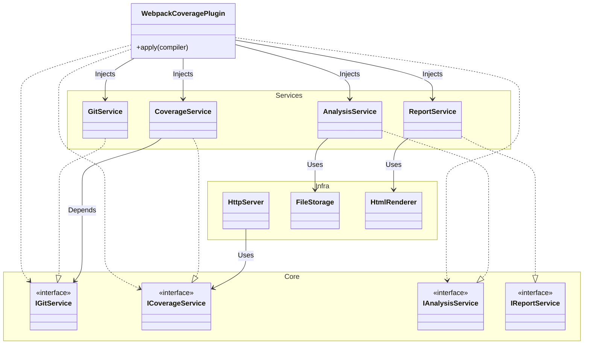
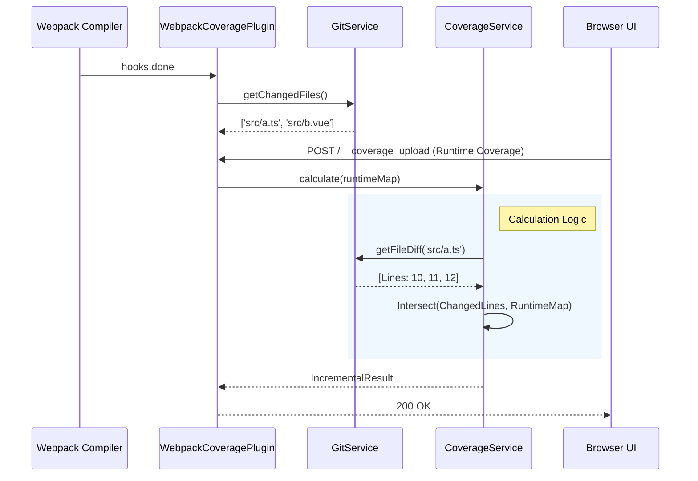

# 技术架构文档 (Technical Documentation)

## 1. 架构概览 (Architecture Overview)

本插件采用 **Clean Architecture (整洁架构)** 设计，旨在实现关注点分离、提高可测试性和系统的可维护性。

### 核心分层
- **Core Layer (`src/core`)**: 定义核心业务实体 (Types) 和抽象接口 (Interfaces)。不依赖其他层。
- **Service Layer (`src/services`)**: 实现具体的业务逻辑 (`GitService`, `CoverageService`)。只依赖 Core 层的接口。
- **Infrastructure Layer (`src/infra`)**: 处理外部依赖和具体实现细节 (UI生成, 文件存储, HTTP服务)。

### 架构图 (Class Diagram)



## 2. 核心流程 (Core Flows)

### 2.1 增量覆盖率计算流程



### 2.2 影响面分析流程 (带缓存)

```mermaid
flowchart TD
    Start[Start Compilation] --> Init[Init Dependency Graph]
    Init --> CheckCache{Match Hash?}
    
    CheckCache -- Yes --> LoadCache[Load from FileStorage]
    CheckCache -- No --> ParseAST[Parse AST (Babel)]
    ParseAST --> ComputeHash[Compute Content Hash]
    ComputeHash --> ExtractDeps[Extract Imports/Exports]
    ExtractDeps --> SaveCache[Save to FileStorage]
    
    LoadCache --> BuildGraph[Build Dependency Graph]
    SaveCache --> BuildGraph
    
    BuildGraph --> Analyze[Analyze Impact]
    Analyze --> IdentifyPages[Identify Affected Pages]
    IdentifyPages --> End[Return ImpactResult]
```

## 3. 目录结构说明

```
src/
├── core/                 # 核心定义
│   ├── interfaces.ts     # 服务接口
│   └── types.ts          # 类型定义
├── services/             # 业务逻辑服务
│   ├── git.service.ts
│   ├── coverage.service.ts
│   ├── analysis.service.ts
│   └── report.service.ts
├── infra/                # 基础设施
│   ├── http.server.ts    # 嵌入式 Express 服务
│   ├── storage.ts        # 文件缓存
│   └── report/           # 报告生成器
│       ├── html.renderer.ts
│       └── templates/    # HTML/CSS 模板
└── index.ts              # 插件入口 (Composition Root)
```

## 4. 扩展指南

### 添加新的报告格式
1. 在 `src/infra/report/` 下新建 Renderer (如 `markdown.renderer.ts`)。
2. 实现 `render(data: ReportData): string` 方法。
3. 在 `ReportService` 中调用该 Renderer。

### 对接新的通知渠道
1. 新建 Service (如 `DingTalkService`) 实现 `INotificationService`。
2. 在 `index.ts` 中初始化并注入。
